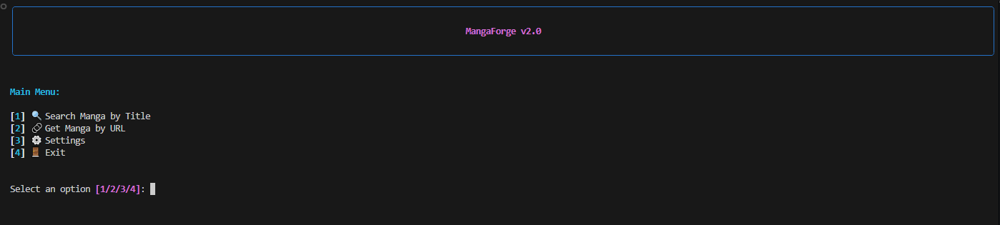

# 🚀 MangaForge

<div align="center">
  <h3>🎯 Beautiful Python CLI Manga Downloader</h3>
  <p><strong>Plugin-based architecture supporting multiple manga sources with a gorgeous Rich-based interface</strong></p>

  [](https://python.org)
  [](https://opensource.org/licenses/MIT)
  [](https://github.com/Yui007/MangaForge/pulls)

  

  <sub><strong>Inspired by <a href="https://github.com/metafates/mangal">mangal</a> but built in Python with modern architecture</strong></sub>
</div>

---

## ✨ Features

<div align="center">

| 🎨 **Beautiful CLI** | 🔌 **Plugin System** | ⚡ **High Performance** | 📦 **Multiple Formats** |
|:---:|:---:|:---:|:---:|
| Rich-based interface | Auto-discover providers | Parallel downloads | CBZ, PDF, Images |
| Interactive menus | Drop-in architecture | Concurrent processing | Live progress bars |
| Paginated tables | No core modifications | Smart rate limiting | Beautiful output |

</div>

## 🌟 Current Providers

<div align="center">

| Provider | Status | Description |
|:---:|:---:|:---:|
| **Bato** � | ⛔ **Site Taken Down** | Site has been permanently shut down |
| **WeebCentral** 🟢 | ✅ **Fully Working** | High-quality manga scans |
| **MangaPark** � | ⛔ **Site Taken Down** | Site has been permanently shut down |
| **MangaBuddy** 🟢 | ✅ **Fully Working** | Fast and reliable source |
| **AsuraComic** 🟢 | ✅ **Fully Working** | Premium manga hosting |
| **WebToons** 🟢 | ✅ **Fully Working** | Premium webtoon hosting |
| **MangaKakalot** 🟢 | ✅ **Fully Working** | Large manga library |
| **VyManga** 🟢 | ✅ **Fully Working** | Premium manga and webtoon hosting |
| **Toonily** 🟢 | ✅ **Fully Working** | SFW/NSFW webtoon and Manhwa hosting |
| **KaliScan** 🟢 | ✅ **Fully Working** | High-quality manga hosting with modern interface |
| **ManhuaScan** 🟢 | ✅ **Fully Working** | Rich manhua Library hosting |
| **Comix** 🟢 | ✅ **Fully Working** | API-based manga reader with scanlator groups |
| **MangaBall** 🟢 | ✅ **Fully Working** | Multi-language manga hosting |
| **WeebDex** 🟢 | ✅ **Fully Working** | API-based manga reader with high-quality images |

> **🟢 Fully Tested** | **🟡 Basic Testing** | **⚪ In Development**
>
> *More providers coming soon!*

</div>

## 🚀 Quick Start

### 1. **Clone & Setup**
```bash
git clone https://github.com/Yui007/MangaForge.git
cd MangaForge

# Create virtual environment (recommended)
python -m venv venv
# On Windows:
venv\Scripts\activate
# On macOS/Linux:
source venv/bin/activate

# Install dependencies
pip install -r requirements.txt
```

### 2. **Launch CLI**
```bash
python main.py
```

<div align="center">
  
</div>

### 3. **Search & Download**
1. **Search**: Choose "[1] 🔍 Search Manga by Title"
2. **Select Provider**: Pick from 12 available sources
3. **Browse Results**: Navigate paginated results
4. **Download**: Select chapters and format (CBZ/PDF/Images)

---

## 📖 Usage Examples

### Search for Manga
```bash
# Launch CLI
python main.py

# Select: [1] Search Manga by Title
# Choose provider: WeebCentral, MangaBall, etc.
# Enter: "attack on titan"
# Browse results and select manga
```

### Download by URL
```bash
# Select: [2] Get Manga by URL
# Enter manga URL from any supported provider
# Auto-detect provider and fetch chapters
```

### Configuration
```bash
# Select: [3] Settings
# Configure:
# - Download directory
# - Parallel workers
# - Output format (CBZ/PDF/Images)
# - Preferred language & scanlator
# - Network timeout
```

---

## 🏗️ Architecture

```
MangaForge/
├── 🧠 core/              # Core system (locked)
│   ├── base_provider.py  # Provider interface
│   ├── downloader.py     # Parallel downloads
│   ├── converter.py      # Format conversion
│   └── config.py         # Settings management
├── 📊 models/           # Data structures
├── 🔌 providers/        # Plugin providers
│   ├── bato.py         # Bato provider ⛔ (site taken down)
│   ├── weebcentral.py  # WeebCentral ✅
│   ├── mangapark.py    # MangaPark ⛔ (site taken down)
│   ├── mangabuddy.py   # MangaBuddy ✅
│   ├── asuracomic.py   # AsuraComic ✅
│   ├── webtoons.py     # Webtoons ✅
│   ├── mangakakalot.py # MangaKakalot ✅
│   ├── vymanga.py      # VyManga ✅
│   ├── toonily.py      # Toonily ✅
│   ├── kaliscan.py     # KaliScan ✅
│   ├── manhuascan.py   # ManhuaScan ✅
│   ├── comix.py        # Comix ✅
│   ├── mangaball.py    # MangaBall ✅
│   └── weebdex.py      # WeebDex ✅
├── 🎨 cli/              # Beautiful interface
├── ⚙️ config/           # Settings
└── 📥 downloads/        # Downloaded manga
```

## 🔧 Advanced Features

### Provider System
- **🔌 Plugin Architecture**: Add providers without touching core code
- **🔍 Auto-Discovery**: Drop `.py` files in `providers/` folder
- **🛡️ Error Handling**: Robust failure recovery
- **⚡ Performance**: Optimized scraping and parsing

### Download System
- **🔄 Parallel Processing**: Configurable workers for chapters
- **📈 Live Progress**: Real-time progress bars
- **🔁 Resume Support**: Continue interrupted downloads
- **📊 Smart Queuing**: Efficient resource utilization

### Output Formats
- **📚 CBZ**: Comic book archive (ZIP format)
- **📄 PDF**: Portable document format
- **🖼️ Images**: Individual image files
- **🎯 Quality Control**: Configurable image processing

### 🌐 Language & Scanlator Filtering

Some providers (MangaBall, WeebDex, Comix) host chapters in multiple languages or from different scanlation groups. You can set your preferences in `config/settings.yaml`:

```yaml
providers:
  preferred_language: en          # ISO language code (en, es, fr, pt-br, id, ko, ja, zh, etc.)
  preferred_scanlator: ''         # Scanlation group name (empty = accept any)
```

- **`preferred_language`**: Filters chapters by language. Set to `en` for English (default). Leave empty to show all languages.
- **`preferred_scanlator`**: When multiple groups translate the same chapter, picks the one matching this name. Leave empty to accept any group.

You can also change these at runtime via **Settings → [7] Change Preferred Language** or **[8] Change Preferred Scanlator** in the CLI.

### 🔥 FlareSolverr (Required for MangaKakalot)

The **MangaKakalot** provider uses [FlareSolverr](https://github.com/FlareSolverr/FlareSolverr) to bypass Cloudflare protection. You must have it running before using these providers.

**Setup:**

1. Download the latest release for your platform from:  
   👉 **[FlareSolverr Releases](https://github.com/FlareSolverr/FlareSolverr/releases)**

2. Run it:
   ```bash
   # Windows: extract and run the .exe
   ./FlareSolverr.exe

   # Linux: extract and run the binary
   chmod +x ./FlareSolverr
   ./FlareSolverr

   # Docker (alternative)
   docker run -p 8191:8191 ghcr.io/flaresolverr/flaresolverr:latest
   ```

3. FlareSolverr defaults to `http://localhost:8191` — MangaForge will connect to it automatically.

> ⚠️ **Without FlareSolverr running**, MangaKakalot will fail with connection errors.

---

## 🛠️ Development

### Adding New Providers

Create a new file in `providers/`:

```python
from core.base_provider import BaseProvider
from models import MangaSearchResult, MangaInfo, Chapter

class NewProvider(BaseProvider):
    provider_id = "newprovider"
    provider_name = "New Provider"
    base_url = "https://newprovider.com"

    def search(self, query: str, page: int = 1):
        # Implement search logic
        pass

    def get_manga_info(self, manga_id: str = None, url: str = None):
        # Implement manga info extraction
        pass

    def get_chapters(self, manga_id: str):
        # Implement chapter listing
        pass

    def get_chapter_images(self, chapter_id: str):
        # Implement image extraction
        pass
```

**✨ Auto-discovered!** No core modifications needed.

### Running Tests

```bash
# Core system tests
python test_core_system.py

# CLI system tests
python test_cli_system.py

# All tests
python test.py
```

---

## 📋 Requirements

- **Python**: 3.10 or higher
- **Dependencies**: See `requirements.txt`
- **FlareSolverr**: Required for MangaKakalot (see [setup above](#-flaresolverr-required-for-mangakakalot))

### Virtual Environment Setup

```bash
# Create virtual environment
python -m venv venv

# Activate (Windows)
venv\Scripts\activate

# Activate (macOS/Linux)
source venv/bin/activate

# Install dependencies
pip install -r requirements.txt

# Deactivate when done
deactivate
```

---

## 🌟 Comparison with Similar Projects

| Feature | MangaForge | mangal |
|:---:|:---:|:---:|
| **Language** | Python 🐍 | Go 🏃 |
| **Interface** | Rich CLI 🎨 | TUI |
| **Providers** | 12 active (growing) 📈 | 10+ |
| **Architecture** | Plugin-based 🔌 | Built-in |
| **Customization** | YAML config ⚙️ | CLI flags |
| **Output Formats** | CBZ, PDF, Images 📦 | CBZ only |

**MangaForge brings the mangal experience to Python with:**
- 🎨 **Beautiful Rich-based CLI**
- 🔌 **True plugin architecture**
- ⚙️ **Flexible configuration**
- 📦 **Multiple output formats**

---

## 🤝 Contributing

Contributions are welcome! Here's how to help:

### 🚀 Quick Start for Contributors

```bash
# Fork and clone
git clone https://github.com/YOUR_USERNAME/MangaForge.git
cd MangaForge

# Setup development environment
python -m venv venv
source venv/bin/activate  # or venv\Scripts\activate on Windows
pip install -r requirements.txt

# Run tests
python test.py

# Launch CLI
python main.py
```

### 📝 Adding Providers

1. **Create provider file** in `providers/`
2. **Implement 4 methods**: `search()`, `get_manga_info()`, `get_chapters()`, `get_chapter_images()`
3. **Test thoroughly** with real data
4. **Submit PR** with provider name and description

### 🐛 Reporting Issues

- **🐛 Bugs**: Use GitHub Issues with detailed error logs
- **💡 Features**: Create feature requests with use cases
- **📖 Docs**: Help improve documentation

---

## 📄 License

**MIT License** - See [LICENSE](LICENSE) file for details.

---

<div align="center">

## 🎯 Ready to Download Manga?

```bash
# Quick setup
git clone https://github.com/Yui007/MangaForge.git
cd MangaForge
python -m venv venv
source venv/bin/activate
pip install -r requirements.txt
python main.py
```

**🌟 Enjoy your manga collection!**

[](https://github.com/Yui007/MangaForge)
[](https://python.org)

</div>